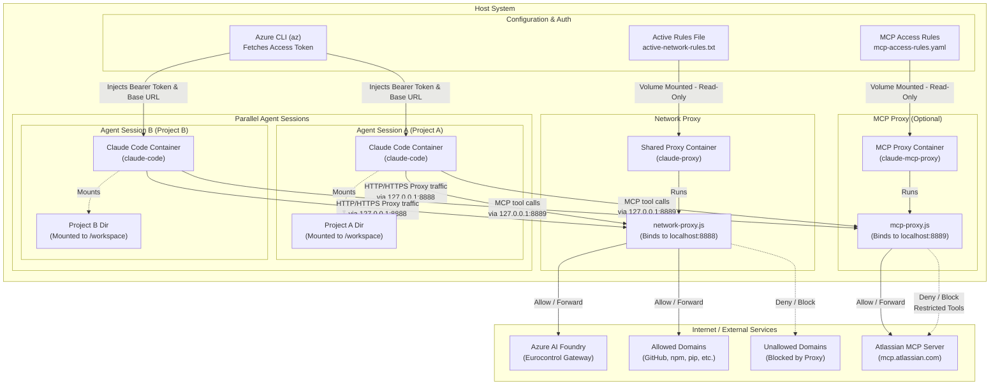

# claude-en-boite

Run [Claude Code](https://claude.ai/code) inside a rootless Podman container, authenticated via Azure AI Foundry, and with a limited internet connectivity.

## Prerequisites

This tool requires **Podman** and the **Azure CLI**. Follow the instructions below to install them:

> [!NOTE]
> **Windows Users**: The scripts in this repository are written for Unix/macOS environments. If you are running on Windows, you can ask Claude to adapt the bash scripts (`install-claude-podman.sh` and `claude-podman.sh`) to PowerShell or Batch scripts.

### 1. Podman
* **macOS** (via Homebrew):
  ```bash
  brew install podman
  podman machine init
  ```
  *(Note: The scripts will automatically initialize and start the Podman machine if missing, stopping it when execution finishes.)*
* **Ubuntu / Debian**:
  ```bash
  sudo apt-get update && sudo apt-get install -y podman
  ```
  *(Note: `install-claude-podman.sh` will automatically attempt to install it on Debian/Ubuntu systems if it is missing)*

### 2. Azure CLI
* **macOS** (via Homebrew):
  ```bash
  brew install azure-cli
  ```
* **Ubuntu / Debian**:
  ```bash
  curl -sL https://aka.ms/InstallAzureCLIDeb | sudo bash
  ```

Once installed, authenticate your Azure CLI session:
```bash
az login
```

### 3. Environment Variable
Define the `ANTHROPIC_FOUNDRY_BASE_URL` environment variable on your host system:
```bash
export ANTHROPIC_FOUNDRY_BASE_URL="https://blablabla-ai-gate.azure-api.net/ai/anthropic"
```

## Setup

Build the container image once:

```bash
./install-claude-podman.sh
```

This creates a local `claude-code` image based on Alpine Linux with Node.js, Python, pre-installed MCP servers, and the Claude Code CLI. It also installs a `claude-podman` symlink into `~/.local/bin/` so the command is available system-wide.

### MCP & Claude Configuration Resolution

During image build (`install-claude-podman.sh`), Claude settings and MCP server definitions are loaded from the first existing config file in the following order:
1. `$CLAUDE_CONFIG_FILE` (environment variable path)
2. `./.claude.json` or `./claude.local.json` (local project override, gitignored)
3. `./claude.json` (current workspace default)
4. `~/.config/claude-podman/claude.json` (global user configuration)
5. Default [`claude.json`](claude.json) in the repository

Example `claude.json`:
```json
{
  "mcpServers": {
    "atlassian": {
      "type": "http",
      "url": "https://mcp.atlassian.com/v1/mcp"
    }
  }
}
```


## Usage

From any project directory:

```bash
claude-podman
```

The script:
1. Fetches a short-lived Azure Cognitive Services token via `az account get-access-token`
2. Mounts the current directory into the container as `/workspace`
3. Passes an enriched `CLAUDE.md` to the container (including host instructions from `~/.claude/CLAUDE.md` if present, enriched with Alpine Linux environment and network rules context)
4. If an `mcp-access-rules.yaml` config is present, starts the MCP access control proxy and rewrites the MCP server URL to route through it
5. Launches an interactive Claude Code session against the Azure AI Foundry endpoint

Any extra arguments are forwarded to `claude`:

```bash
claude-podman "explain this codebase"
```

## Network Security Rules

`claude-podman` runs outbound network security filtering inside a **dedicated Podman proxy container** (`claude-proxy`). The agent container (`claude-code`) cannot inspect, tamper with, or kill the proxy server process, and has no access to the rules configuration file.

### Configuration File Resolution

Rules are loaded from the first existing config file in the following order:
1. `$NETWORK_RULES_FILE` (environment variable path)
2. `./.claude-network-rules` or `./network-rules.local.txt` (local project override, gitignored)
3. `./network-rules.txt` (current workspace default)
4. `~/.config/claude-podman/network-rules.txt` (global user configuration)
5. Default [`network-rules.txt`](network-rules.txt) in the repository

### Rule Format & Examples

Edit your rules file using scheme, hostname, port, and wildcard (`*`) patterns:

```text
# Allow all HTTPS traffic
https://*

# Allow specific endpoint
https://www.google.com

# Allow domain and all subdomains
https://*.azure.com
https://*.github.com

# Allow local HTTP services
http://localhost:*

# Allow all traffic across all schemes
*
```

> [!NOTE]
> The Azure AI Foundry endpoint specified by `ANTHROPIC_FOUNDRY_BASE_URL` is automatically allowed so Claude Code authentication works without manual rule entries.

## MCP Access Control

When an `mcp-access-rules.yaml` configuration file is present, `claude-podman` starts an additional **MCP proxy container** (`claude-mcp-proxy`) that intercepts MCP tool calls between the Claude Code agent and the remote Atlassian MCP server. This provides resource-level write restrictions while leaving read operations unrestricted.

The MCP proxy sits between Claude Code and `mcp.atlassian.com`, inspecting JSON-RPC `tools/call` requests. Write operations (create, update, delete) are checked against an allowlist before being forwarded. Blocked operations return a clear error message to the agent.

### Why a Separate Proxy?

The network proxy (`claude-proxy`) handles HTTPS via CONNECT tunneling and can only filter by domain. MCP traffic is encrypted inside the TLS tunnel, so inspecting tool calls requires a dedicated application-layer proxy that terminates the MCP protocol.

### MCP Access Rules Configuration

Rules are loaded from the first existing config file in the following order:
1. `$MCP_RULES_FILE_ENV` (environment variable path)
2. `./.mcp-access-rules.yaml` (local project override, gitignored)
3. `./mcp-access-rules.local.yaml` (local project override, gitignored)
4. `./mcp-access-rules.yaml` (current workspace default)
5. `~/.config/claude-podman/mcp-access-rules.yaml` (global user configuration)

See [`mcp-access-rules.yaml.example`](mcp-access-rules.yaml.example) for the full format. A minimal example:

```yaml
upstream: https://mcp.atlassian.com/v1/mcp

# Read tools pass through unrestricted
allow:
  - confluence_search
  - confluence_get_*
  - jira_get_*
  - jira_search

# Block destructive operations
deny:
  - confluence_delete_page

# Write tools restricted to specific resources
restrict:
  confluence_update_page:
    field: pageId
    allowed: ["12345678", "98765432"]
  jira_update_issue:
    field: issueKey
    allowed: ["PROJ-*"]

# Block any tool not listed above
default: deny
```

### Rule Evaluation Order

For each `tools/call` request, the proxy evaluates in this order:
1. **Deny list** — if the tool name matches, the call is blocked
2. **Allow list** — if the tool name matches, the call is forwarded
3. **Restrict list** — if the tool name matches, the specified argument field is checked against the allowed values (supports `PREFIX-*` wildcards)
4. **Default policy** — `deny` blocks unknown tools, `allow` permits them

All non-`tools/call` MCP messages (`initialize`, `tools/list`, notifications) pass through transparently.

### Audit Logging

Every tool call is logged by the MCP proxy with a `[MCP FILTER]` prefix:
```
[MCP FILTER] ALLOWED tool=confluence_search reason=allow-list
[MCP FILTER] DENIED tool=confluence_update_page reason=Tool 'confluence_update_page' blocked for pageId='99999'. Allowed: [12345678, 98765432].
```

View the logs with:
```bash
podman logs claude-mcp-proxy
```

### Config Hot-Reload

The MCP proxy detects changes to the rules file automatically (via mtime check). Edit the config file while a session is running and the new rules take effect on the next tool call.

## How it works

### Architecture Diagram



### Component Details

| Component | Detail |
|---|---|
| Base image | `alpine:3.22` |
| Agent container | `claude-code` — runs Claude Code as unprivileged user `claude` (UID 1000) |
| Network proxy container | `claude-proxy` — isolated sidecar running `network-proxy.js` on port 8888 (domain-level filtering) |
| MCP proxy container | `claude-mcp-proxy` — optional sidecar running `mcp-proxy.js` on port 8889 (MCP tool-level filtering, started only when `mcp-access-rules.yaml` exists) |
| Podman Network | Shared `claude-net` bridge network linking agent containers and the shared proxy container |
| Userns | `keep-id` — files created in the container are owned by the host user |
| AI endpoint | Loaded from host `$ANTHROPIC_FOUNDRY_BASE_URL` environment variable |
| Auth | Azure Cognitive Services bearer token (refreshed each run) |
| Permissions | `--dangerously-skip-permissions` — container isolation is the security boundary |


## Troubleshooting

- **`ANTHROPIC_FOUNDRY_BASE_URL environment variable is not set`** — define `ANTHROPIC_FOUNDRY_BASE_URL` in your terminal environment before running.
- **`az account get-access-token` fails** — run `az login` first.
- **Token expired mid-session** — restart the script; it fetches a fresh token each run.
- **File permission issues** — ensure `--userns=keep-id` is supported by your Podman version (`podman --version` ≥ 3.0). If files created/modified by the container cannot be updated on the host (e.g., due to host user UID mismatch), upgrade to Podman ≥ 4.3.0, which maps the host user to container UID/GID 1000 (`--userns=keep-id:uid=1000,gid=1000`). To fix the permissions of existing files in the workspace, run: `podman unshare chown -R 0:0 .`
